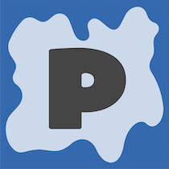
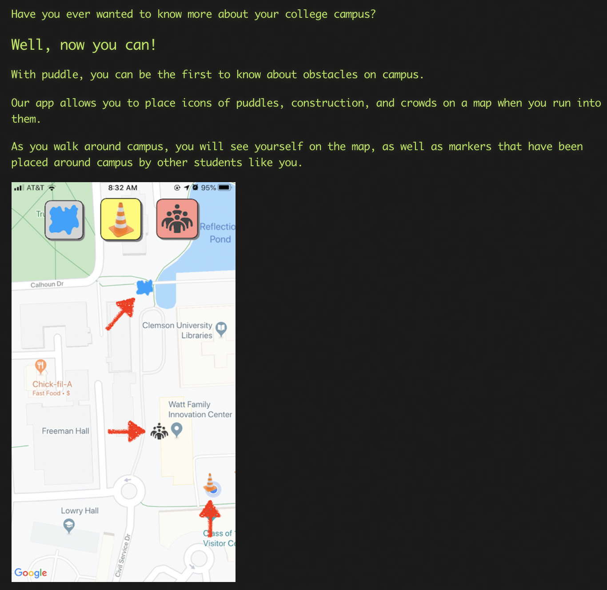

## At this hackathon I helped create the user interface portion of the Puddle iOS Application that uses a map to alert people of nearby obstacles on campus, which won best use of Radar.io in competition.

