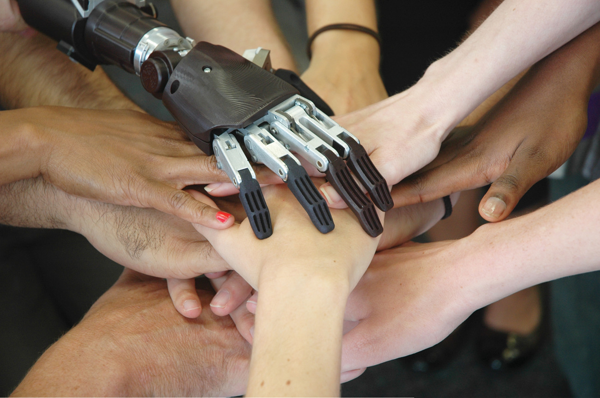
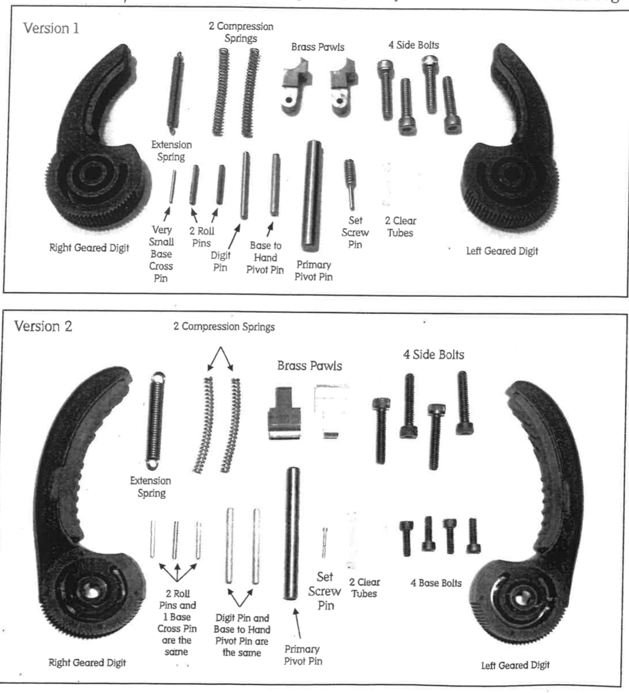

## The purpose of this Honors Mini-Grant is to allow me to work on a personal project for my academic and intellectual development. I took this opportunity to focus on and enhance my skills and knowledge in two disciplines I have always been interested in: prosthetics in bioengineering, and computer programming. 

## I am a bioengineering major, and one of the areas of bioengineering that I want to learn more about is prosthetics. In the future, I hope to help others who are physically challenged, and this is what draws me to the field of prosthetics. I am interested in researching more about prosthetics, and I wanted to use my summer to learn about the physics and mathematics behind how prosthetics are made, and what different materials are used in their manufacturing. 

## I took the Engineering 2080 class at Clemson last semester where I learned how to design parts and assemble complex machines in SolidWorks, so I am also looking into the mechanical side of designing prosthetic machinery. In addition to reading books and academic journals about this subject, I am getting a hands-on experience which will allow me to design my own prosthetic appendage. 

## This initiative is especially important to me because the hand that I build will be tested and sent to an amputee in a developing country. Many people in developing countries have been injured due to factory accidents or landmine hazards. Building this hand will not only enrich my educational experience and knowledge with prosthetics, but it will also allow me to give a hand to someone who needs it. I want to be able to make a positive difference in someone’s life and this is the perfect way for me to do it. 

## I am also pursuing a Computer Science minor at Clemson. Last semester, I took an Intro to Computer Science class, where I learned how to program in C. I found this class very interesting because I had never done a computer science course before. I’ve discovered that I enjoy programming in C, and I am passionate about learning how to program. Also, in my engineering class last semester, I learned how to program in MATLAB. This was also a very enjoyable experience for me, and I realized that programming is something I enjoy. 

## This summer, I am also using my time to take a course for learning how to code in Python. Python interests me because it is one of the most popular programming languages, and I believe that learning how to code in Python will not only sharpen my programming skills but will also allow me to get a broader experience with programming. Learning programming skills will complement my engineering career because nowadays advancement in engineering comes hand in hand with computer science knowledge. 

